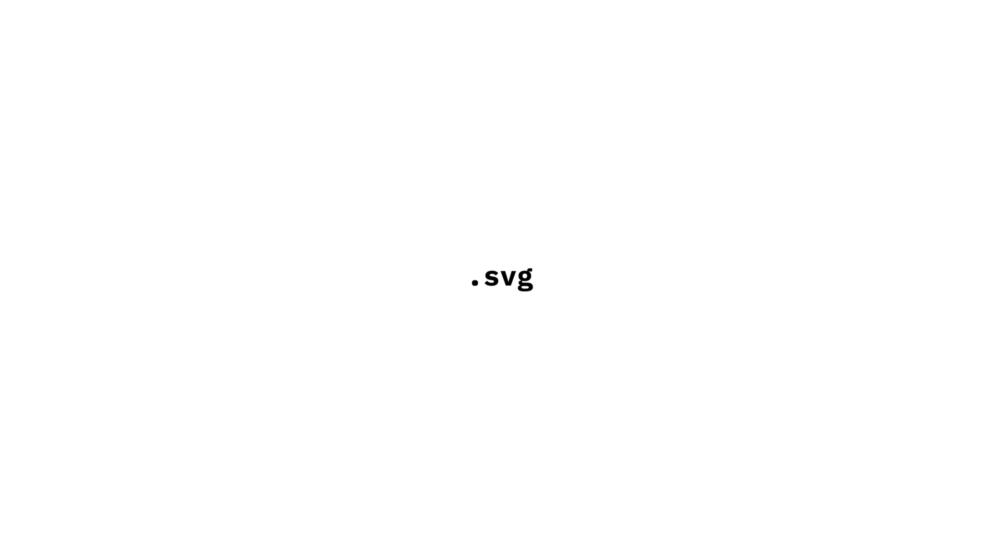
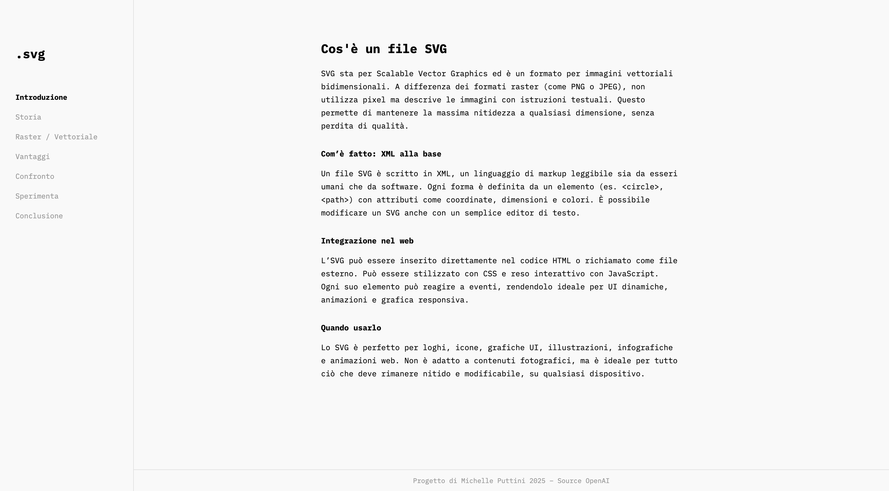
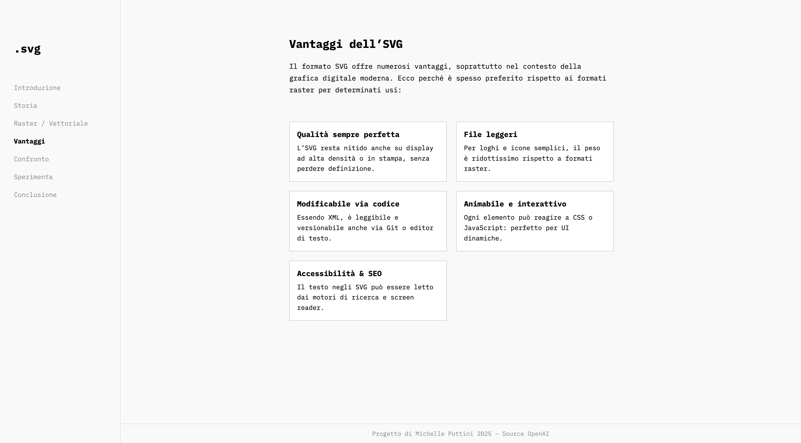

SUPSI 2025  
Corso d’interaction design, CV428.01  
Docenti: A. Gysin, G. Profeta  

Elaborato 1: .svg

# svg  
Michelle Puttini  
🔗 [Link al sito](https://michelleputtini.github.io/svg/)


## Introduzione e tema

Il progetto nasce con l’idea di spiegare in modo semplice e accessibile cosa sia un file SVG, senza rinunciare alla precisione tecnica.  
Il sito è pensato per chi non ha mai sentito parlare di questo formato, ma vuole capire come funziona, quando conviene usarlo e perché è così importante nel web design e nella grafica moderna.

L’approccio è professionale ma chiaro, senza tecnicismi inutili, con esempi visivi e una parte interattiva che permette di sperimentare dal vivo come si crea un SVG.


## Riferimenti progettuali

Il progetto prende spunto da diverse fonti, tra cui:

- le documentazioni ufficiali di **MDN** (Mozilla Developer Network) e **W3C** (World Wide Web Consortium), che ho consultato con l’aiuto di ChatGPT per approfondire il funzionamento tecnico e lo standard alla base del formato SVG  

- l’articolo di Adobe dedicato al formato SVG, utile per capire in quali contesti viene usato professionalmente  

- visivamente non ho seguito una reference precisa. Ho costruito il sito pian piano, cercando di mantenere più aria e pulizia possibile per dare valore ai contenuti e rendere la lettura leggera

Mi sono ispirata alla **grafica svizzera**: rigore, griglie, tipografia pulita e contenuti ben organizzati.


## Design dell’interfaccia e modalità di interazione

Il sito è strutturato a sezioni singole visibili una alla volta, con navigazione laterale sempre accessibile.  
Il layout è pensato per offrire un’esperienza ordinata e piacevole, senza fronzoli. Ogni sezione ha uno scopo preciso: introdurre, spiegare, confrontare, e infine far sperimentare.

Nella sezione *Sperimenta* è possibile disegnare forme (cerchio, rettangolo, triangolo), scegliere i colori, le dimensioni, e vedere il codice SVG generarsi in tempo reale. È tutto modificabile anche il codice che si crea man mano.


## Tecnologia usata

Il sito è stato sviluppato da zero usando **HTML**, **CSS** e **JavaScript**, senza librerie esterne.

La parte interattiva si basa su due box principali:  
- uno è il **canvas SVG**, dove l’utente può disegnare cliccando  
- l’altro è il **box di codice**, che si aggiorna automaticamente in tempo reale mostrando il codice SVG generato  

Per farli comunicare, ho usato JavaScript per ascoltare i click sull’area di disegno, creare l’elemento SVG giusto (cerchio, rettangolo, triangolo) e poi aggiornare dinamicamente il codice XML nel box a destra.

Ecco la parte di codice che gestisce il disegno e l’aggiornamento del codice:

```JavaScript
drawingArea.addEventListener("click", (e) => {
  const pt = drawingArea.createSVGPoint();
  pt.x = e.clientX;
  pt.y = e.clientY;
  const svgP = pt.matrixTransform(drawingArea.getScreenCTM().inverse());

  let shape;
  if (currentTool === "circle") {
    shape = document.createElementNS("http://www.w3.org/2000/svg", "circle");
    shape.setAttribute("cx", svgP.x);
    shape.setAttribute("cy", svgP.y);
    shape.setAttribute("r", size / 2);
  }
  // ...altri strumenti...

  shape.setAttribute("fill", fillColor);
  shape.setAttribute("stroke", strokeColor);
  shape.setAttribute("stroke-width", strokeWidth);
  drawingArea.appendChild(shape);
  updateCode();
});

svgCode.addEventListener("input", function () {
  const code = this.value;
  const parser = new DOMParser();
  const svgDoc = parser.parseFromString(code, "image/svg+xml");
  drawingArea.innerHTML = "";
  Array.from(svgDoc.documentElement.children).forEach(child => {
    drawingArea.appendChild(child);
  });
  updateCode();
});
```

## Target e contesto d’uso
Il sito è pensato per studenti, designer e sviluppatori alle prime armi, ma anche per chiunque sia curioso di capire cos’è un SVG e come si usa.
È adatto a contesti didattici o autodidattici, ed è pensato per chi vuole imparare facendo: ogni concetto è spiegato, mostrato e poi “provabile” attraverso l’interfaccia interattiva.

L’obiettivo è rendere l’SVG comprensibile e stimolante anche per chi non ha una formazione tecnica, ma vuole iniziare a usarlo con consapevolezza.

## Media di progetto







## Interazione live nel canvas

